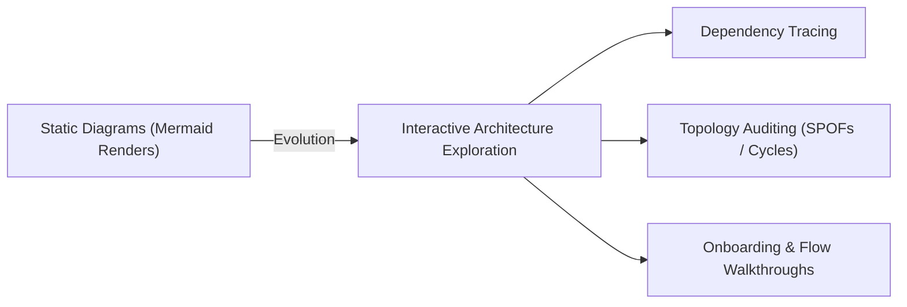
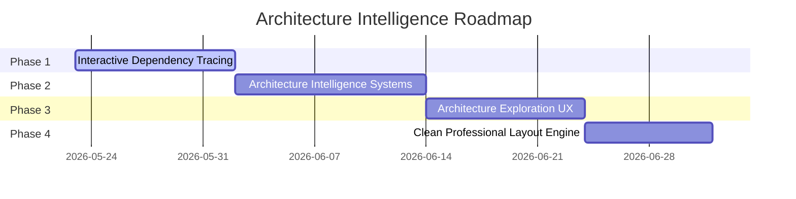

# Specification: Architecture Intelligence & Exploration Layer

This document details the architectural specification, design principles, and execution roadmap for transforming **ArcmindAI** from a static diagram generation utility into an interactive **Architecture Intelligence & Exploration Platform**.

---

## 1. Executive Summary & Vision Shift

Modern engineering teams require more than static, non-interactive diagram renders to comprehend complex software systems. They need the ability to trace dependency pathways, evaluate the blast radius of service failures, isolate distinct domains, and run guided walkthroughs.

This specification maps the transition of ArcmindAI from a static visualization output tool into an active, cognitive developer tool.

### Core Alignment Matrix

| Dimension        | Old Direction                                     | New Correct Direction                            |
| :--------------- | :------------------------------------------------ | :----------------------------------------------- |
| **Primary Goal** | Animated system visualization playground          | Interactive architecture intelligence system     |
| **Core Value**   | Cinematic visuals & complex custom physics        | Clean developer cognition & dependency analysis  |
| **UX Strategy**  | Continuous floating motion / force-directed drift | Stable mental mapping & deterministic tier grids |
| **PR Strategy**  | Massive repository-wide refactors & animations    | Small, modular, reviewer-friendly feature sets   |

---

## 2. Main Problem Statement

- **Current State**: Users can describe a system and receive a static Mermaid diagram or force-directed cluster. However, they cannot interactively explore service relationships, analyze single points of failure (SPOFs), isolate subsystems, or trace request paths dynamically.
- **Target State**: Developers should have a professional, whiteboard-style interactive workspace where they can audit architectural complexity, trace upstream/downstream dependencies contextually, simulate service outages (blast-radius analysis), and toggle layer visibilities instantly.

---

## 3. Four-Phase Execution Roadmap

### Phase 1 — Interactive Dependency Tracing

_Goal: Enable developers to isolate and explore service relationships dynamically._

1. **Upstream Dependency Tracing**:
   - Selecting a microservice highlights all client entry points, gateways, and upstream APIs that directly or indirectly trigger it.
2. **Downstream Dependency Tracing**:
   - Highlights the complete blast-radius (databases, queues, external APIs, and downstream services) triggered by the selected node.
3. **Dependency Flow Visualization**:
   - Renders clean directional flows along connection paths, showing data packet motion indicators traversing request routes.
4. **Subgraph Isolation**:
   - Fades unrelated nodes (`opacity-10`) and dims irrelevant connectors to isolate active dependency chains during selection.

---

### Phase 2 — Architecture Intelligence Systems

_Goal: Provide programmatic system audits directly on the diagram topology._

1. **Critical Node Detection**:
   - Programmatically compute connection degree centrality to flag highly connected hubs (e.g. database nodes queried by multiple services without caches).
2. **Single Point of Failure (SPOF) Detection**:
   - Highlight bottlenecks whose removal isolates downstream nodes or entirely breaks connection routing.
3. **Failure Propagation Analysis**:
   - Simulate a service outage on click. Color-code downstream nodes to show cascade failures if a central service becomes unavailable.
4. **Architecture Hotspot Analysis**:
   - Render thermal heatmaps representing connection complexity to identify architectural regions requiring refactoring or caching.

---

### Phase 3 — Architecture Exploration UX

_Goal: Simplify onboarding and promote cognitive comprehension of large topologies._

1. **Focus / Isolation Mode**:
   - Allow developers to zoom and isolate a specific microservice domain (e.g., Auth services, Payment services) and hide other domains.
2. **Layer Visibility Controls**:
   - HUD checklist allowing users to toggle visibility of different system categories:
     - **Frontend/Clients**
     - **Gateways/Load Balancers**
     - **Core Backend Services**
     - **Infrastructure (Queues/Caches)**
     - **Databases/Storage**
3. **Progressive Detail Disclosure**:
   - Keeps the initial view clean. Displays detailed interface specifications, schemas, endpoints, and health logs only when a node is hovered or selected.
4. **Architecture Walkthrough Mode**:
   - Playback control enabling a guided step-by-step transaction tour (e.g. tracing a request from client frontend -> gateway -> auth service -> databases).

---

### Phase 4 — Clean Professional Layout Engine

_Goal: Provide deterministic, readable whiteboard layouts._

1. **Deterministic Layered Layout**:
   - Move away from free-floating force simulations. Nodes must snap into 5 distinct vertical tiers:
     - **Tier 0**: Clients (15% height)
     - **Tier 1**: Gateways (32% height)
     - **Tier 2**: Core Services (50% height)
     - **Tier 3**: Caches / Message Brokers / Infrastructure (68% height)
     - **Tier 4**: Databases / Hard Storage (84% height)
   - Sort nodes in each tier alphabetically by ID to guarantee identical layouts on every render.
2. **Orthogonal Dependency Routing**:
   - Replace complex overlapping diagonal links with clean right-angle paths (`M -> V -> H -> V`), matching standard corporate system schematics.
3. **Collision-Free Positioning**:
   - Implement rigid collision radii boundaries to completely prevent label overlap.
4. **Stable Mental Mapping**:
   - Cache coordinates during layer transitions or model updates to prevent jumpy layout shifts.

---

## 4. Key Engineering & Contribution Rules

To ensure maintainability, code quality, and fast reviews, all development must adhere to these rules:

> [!IMPORTANT]
> **Aesthetic & Utility Rules**
>
> - **Cognition Over Visuals**: Architecture comprehension is more important than animation gimmicks.
> - **Developer Utility Over Complexity**: UI controls must solve real developer understanding problems. Keep visual indicators clear, simple, and high-contrast.
> - **Always Readable**: Topologies must be readable at all times. Prevent node overlaps under all scale levels.

> [!WARNING]
> **PR Strategy & OSS Contribution Rules**
>
> - **Small, Focused PRs**: Do not combine refactoring, layout engine changes, and new features into a single PR. Keep them isolated.
> - **No Unrelated Code Changes**: Avoid modifying files outside the feature scope. Keep dependencies minimal.
> - **No Visual Experimentation**: Do not merge unfinished animation experiments or heavy third-party rendering packages. Use D3 and SVG.
