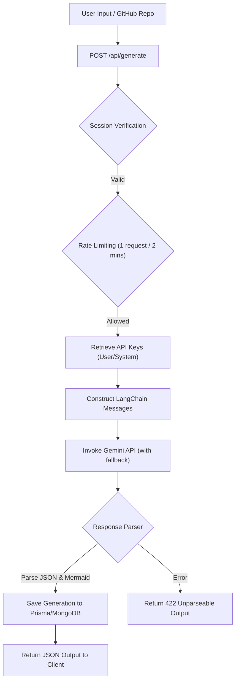

# ArcmindAI System Architecture Notes

This document provides a detailed breakdown of the ArcmindAI architecture, mapping the technical flows, components, schemas, and state management strategies as of Phase 1.

---

## 1. AI Generation Flow & Prompt Pipeline

The core functionality of ArcmindAI is translating natural language ideas (or analyzed repositories) into architectural plans and diagrams.

### Prompt Construction

- **Main Prompt**: Defined in [promptTemplate.ts](file:///d:/arc/arcmindAI/lib/prompts/promptTemplate.ts). It enforces a strict output format consisting of:
  1. `### Explanation` (JSON format matching the `ArchitectureData` type).
  2. `### Architecture Diagram` (Valid Mermaid.js syntax).
- **GitHub Repository Prompt**: Defined in [githubRepoPrompt.ts](file:///d:/arc/arcmindAI/lib/prompts/githubRepoPrompt.ts). Instructs the LLM to output a standalone Mermaid flowchart representing directories, APIs, database, and infrastructure mapped by the repository analyzer.

### Fallback Client

- Invokes Gemini models with fallback procedures to guarantee high availability. Located in `app/(protected)/generate/utils/aiClient`.

---

## 2. Graph & Diagram Rendering System

ArcmindAI supports two rendering systems for generated architectures: static Mermaid.js rendering for standard exports and a high-performance, modular D3-based interactive graph engine.

### A. Static Mermaid.js Rendering

- **Rendering Component**: [mermaidDiagram.tsx](<file:///d:/arc/arcmindAI/app/(protected)/generate/components/mermaidDiagram.tsx>)
  - **Library**: `mermaid` (configured with `securityLevel: "loose"`, `startOnLoad: false`).
  - **Mechanism**: Runs inside a React `useEffect` callback, triggering `mermaid.render` dynamically for a generated unique chart ID and injecting the returned SVG directly into the DOM container.
  - **Downloader**: Uses the `html-to-image` library (`htmlToImage.toPng`) to snapshot the SVG element and trigger a download of the architecture diagram as a PNG.
- **Diagram Cleanups**: Implements string sanitization using [cleanMermaidString.ts](<file:///d:/arc/arcmindAI/app/(protected)/generate/utils/cleanMermaidString.ts>) to filter out common LLM markdown formatting artifacts.

### B. Interactive D3 System Graph Engine (Galaxy Constellation Layout)

The primary workspace view renders architectures as an interactive galaxy constellation. The engine is modularized across several single-responsibility files located in [generate/components/graph/](<file:///d:/arc/arcmindAI/app/(protected)/generate/components/graph>) and [generate/utils/](<file:///d:/arc/arcmindAI/app/(protected)/generate/utils>):

#### 1. Data Processing Pipeline

- **Graph Parser**: [parser.ts](<file:///d:/arc/arcmindAI/app/(protected)/generate/utils/parser.ts>)
  - Converts the raw, AI-generated JSON structure into strongly-typed D3 nodes (`D3Node`) and links (`D3Link`).
  - Classifies nodes into system layers: `gateway`, `microservice`, `database`, `entity`, `infrastructure`.
  - Extracts structural metadata, health statuses, dependencies, and API endpoints.
- **Topological Analyzer**: [insights.ts](<file:///d:/arc/arcmindAI/app/(protected)/generate/utils/insights.ts>)
  - Runs graph-traversal algorithms on parsed node/link configurations to yield system intelligence:
    - **Cycle Detection (DFS)**: Discovers circular dependencies that can cause system lockups.
    - **Bottleneck Analytics**: Locates high-centrality database or message queue nodes.
    - **Single Points of Failure (SPOFs)**: Detects nodes that, if removed, isolate other services.

#### 2. D3 Physics Simulation

- **Force Lifecycle Hook**: [useGraphPhysics.ts](<file:///d:/arc/arcmindAI/app/(protected)/generate/components/graph/useGraphPhysics.ts>)
  - Encapsulates the D3 simulation lifecycle, applying forceCenter, forceManyBody, forceLink, and forceCollide.
  - **Physics Stabilization**: Employs an `alphaDecay` of `0.022` to cool the graph simulation and prevent jitter or infinite oscillations. Uses a `78px` collision circle to prevent overlapping nodes.
  - **Coordinate Cache & Preservation**: Retains coordinates (`x, y, vx, vy`) during layer filters, preventing camera jumps.
  - **Tick Throttling**: Limits React state updates using a `requestAnimationFrame` lock, preventing render loop flooding.

#### 3. Viewport & Presentation Layers

- **Viewport Stage**: [GraphCanvas.tsx](<file:///d:/arc/arcmindAI/app/(protected)/generate/components/graph/GraphCanvas.tsx>)
  - Creates the SVG element and binds the `d3-zoom` event handlers.
  - Tracks zoom transformations and centers nodes dynamically during search focus actions.
- **Memoized Nodes**: [GraphNodeComponent.tsx](<file:///d:/arc/arcmindAI/app/(protected)/generate/components/graph/GraphNodeComponent.tsx>)
  - Renders individual SVG elements (hexagons for microservices, cylinders for databases, diamonds for gateways).
  - Employs custom memo checks on coordinates, active drag state, and selected highlights to minimize global re-renders.
- **Memoized Links**: [GraphLinkComponent.tsx](<file:///d:/arc/arcmindAI/app/(protected)/generate/components/graph/GraphLinkComponent.tsx>)
  - Renders Bezier curves (`d="M... C..."`) showing connection directions. Supports moving particle animations using SVG `<animateMotion>` for active traversal tracing.

#### 4. Control HUD & UI Overlays

- **Parallax Background**: [Starfield.tsx](<file:///d:/arc/arcmindAI/app/(protected)/generate/components/graph/Starfield.tsx>)
  - Renders multiple stars on an HTML5 canvas, shifting positions at a `0.25x` ratio relative to SVG pan offsets to build a 3D parallax effect.
- **Radar Minimap**: [Minimap.tsx](<file:///d:/arc/arcmindAI/app/(protected)/generate/components/graph/Minimap.tsx>)
  - Provides a scaled bird's-eye view tracking viewport coordinates relative to node boundaries.
- **Traversal Controls**: [StoryPlaybook.tsx](<file:///d:/arc/arcmindAI/app/(protected)/generate/components/graph/StoryPlaybook.tsx>) & [GraphControls.tsx](<file:///d:/arc/arcmindAI/app/(protected)/generate/components/graph/GraphControls.tsx>)
  - Supplies buttons for zoom fit, reset, physics pause, trace toggle, and automated playbooks that step through transaction narratives.
- **System Inspector & Layers**: [Sidebar.tsx](<file:///d:/arc/arcmindAI/app/(protected)/generate/components/graph/Sidebar.tsx>)
  - Glassmorphic side panel housing the Layer Filters, Health Dashboard, Vuln Audit tables, Node Inspectors, and API catalogs.

---

## 3. Database Schema & Data Modeling

ArcmindAI uses MongoDB as its primary storage database, interfaced via Prisma ORM.

### Key Data Models (from [schema.prisma](file:///d:/arc/arcmindAI/prisma/schema.prisma)):

1. **User**:
   - Stores profile details (`username`, `email`, `avatar`).
   - Tracks verification state (`isVerified`, `otp`, `otpExpiry`).
   - Manages API Keys (`geminiApiKey`, `openaiApiKey`, encrypted using a user-specific `encryptionKey`).
   - Handles pricing plans (`plan` enum: `free`, `pro`, `enterprise`) and billing subscriptions (`subscriptionId`, `subscriptionStatus`).

2. **Generation**:
   - Associated with `User` via `userId`.
   - Stores the main prompt user input (`userInput`).
   - Stores the structured architecture outputs:
     - `generatedOutput` (JSON containing microservices, entities, database schema, APIs, and infrastructure details).
     - `frontendData` (Frontend structure JSON).
     - `tasksData` (AI-generated development task breakdown).
     - `githubGeneration` (Mermaid code for GitHub repositories).
   - Manages shares (`isPublic`, `shareId`).

3. **ResetPasswordToken**:
   - Handles password recovery flows.

---

## 4. State Management & Sidebars

- **History Context**: Managed client-side via [HistoryContext.tsx](file:///d:/arc/arcmindAI/lib/contexts/HistoryContext.tsx) using the standard React Context API.
  - Fetches the user's past generations from `/api/generate/history`.
  - Provides a global `refetch()` function to keep sidebar listings synchronized when a new architecture is generated or deleted.
- **Routing Table**: Governed by [routes.ts](file:///d:/arc/arcmindAI/lib/routes.ts), separating social pages, authentication routes, API endpoints, profile management, and workspace paths.
- **Component-Level States**: Individual pages (such as `app/(protected)/generate/[id]/page.tsx`) manage local display state including modal dialogs (`ActionDialog`, `AskDoubtCard`, `FrontendStructureDialog`, `TaskGenerationDialog`) and response text fields.

---

## 5. Repository Analysis Engine

The repository analysis pipeline parses external GitHub repositories before system architecture design.

- **Analysis Orchestrator**: [index.ts](file:///d:/arc/arcmindAI/lib/repo-analyzer/index.ts)
  - Uses GitHub REST API to fetch repo metadata, file tree structure, and retrieve up to 50 critical files (e.g., `package.json`, `prisma.schema`, `docker-compose.yml`, `requirements.txt`).
- **Sub-analyzers** (under [lib/repo-analyzer/](file:///d:/arc/arcmindAI/lib/repo-analyzer)):
  - **APIAnalyzer**: Maps REST/GraphQL routes.
  - **ArchitectureAnalyzer**: Detects folder patterns (Next.js, Django, MVC, etc.).
  - **DatabaseAnalyzer**: Identifies databases based on schemas or packages.
  - **DependencyAnalyzer**: Maps dependencies and library configurations.
  - **EnvironmentAnalyzer**: Identifies environment configurations.
  - **InfrastructureAnalyzer**: Detects hosting and orchestration components (Docker, K8s, AWS).
  - **MessagingAnalyzer**: Identifies message queue systems (RabbitMQ, Kafka).
  - **TestAnalyzer**: Maps testing frameworks.
