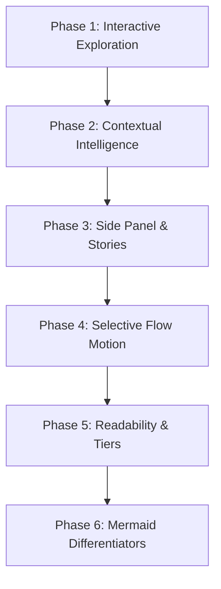

# Specification: Interactive Architecture Workspace UX System

This document outlines the detailed architectural vision, design principles, and UI/UX roadmap for transforming **ArcmindAI** from a static diagram rendering tool into a modern **Interactive Architecture Understanding Workspace**.

---

## 1. Core Problem & Vision Shift

While layout engine improvements structure diagrams visually, standard visualizations still behave mostly like static pictures. To provide real value beyond a basic static image, the diagram canvas must become a dynamic onboarding and diagnostic tool.

### Product Positioning

```
[ AI Diagram Generator ] ──(Evolution)──> [ Interactive Understanding Workspace ]
        │                                                 │
        ├─ Static SVG / PNG Export                        ├─ Upstream/Downstream Dependency Tracing
        └─ Force-Directed Drift                           ├─ Failure Propagation Simulation
                                                          ├─ Interactive Transaction Playbooks
                                                          └─ Deterministic Grid Hierarchy
```

### Visual & Interactive Philosophy

- **Contextual Animation Only**: Avoid visual overload. Animations (such as link flow particles and glowing halos) must activate _only_ during active user selection or playbook playback.
- **Focus-Driven Emphasization**: Fade unrelated nodes (`opacity-10` / `opacity-20`) to let selected subgraphs stand out.
- **Clean Default Viewport**: Hide metadata, link labels, and nested parameters by default. Reveal them progressively on hover or selection to reduce cognitive load.

---

## 2. Six-Phase Functional Specifications



### Phase 1 — Interactive Service Exploration

_Goal: Convert the static topology into a tactile workspace._

- **Service Focus Mode**: Clicking a node isolates its local ecosystem, dims the rest of the canvas, and pans the camera smoothly to center on the selection.
- **Dependency Tracing**: Visually traces request flow routes (Red for Upstream triggers, Cyan for Downstream impacts).
- **Navigation Controls**: Custom SVG minimap radar and camera viewport adjustment HUD (Zoom, Pan, Fit Screen).

---

### Phase 2 — Contextual Architecture Intelligence

_Goal: Provide active diagnostics directly on the canvas._

- **Impact Analysis**: Highlight all downstream services, databases, and message brokers affected by a specific service.
- **Failure Propagation Simulation**: Outage simulator that pulses downstream dependency chains in red, showing cascade failure routes.
- **Topological Warnings**: Programmatic DFS cycle audits, degree centrality analysis, and database contention logs highlighted in the UI.

---

### Phase 3 — Modern Interactive UI/UX System

_Goal: Create a real, professional developer-tooling shell._

- **Contextual Side Panel**: A segmented sidebar displaying service properties, database schemas, alert cards, and global health grading.
- **Interactive Story Playbooks**: Autonomous walking scenarios guiding developers step-by-step through request routes with floating narration commentaries.
- **Layer Visibility HUD**: Checklist controls enabling users to filter layers dynamically (Frontend, Backend, Database, Infrastructure).

---

### Phase 4 — Controlled Animation System

_Goal: Maintain visual calm while showing flow directions._

- **No Idle Chaos**: Zero continuous screen jitter or shaking.
- **Request Flow Motion**: Flowing SVG dash arrays and animated circles (`<animateMotion>`) mapping service-to-service communication paths on hover.
- **Emphasis Glows**: Pulsing warning halos and selection indicators highlighted contextually on active warning card clicks.

---

### Phase 5 — Clean Architecture Readability

_Goal: Enforce strict whiteboard schematics._

- **5-Tier Grid Matrix**: Classify and lock nodes to horizontal grids based on architecture roles (Clients -> Gateways -> Core Services -> Infrastructure -> Storage).
- **Alphabetical Sorting**: Sort nodes within each horizontal tier alphabetically by ID to guarantee 100% deterministic layout rendering.
- **Orthogonal Edge Routing**: Route connectors using vertical-first right angles (`M -> V -> H -> V`).
- **Progressive Detail Disclosures**: Glassmorphic hover-only labels and tooltips to minimize persistent clutter.

---

### Phase 6 — Core Value Differentiators

_Why ArcmindAI outperforms standard static Mermaid diagrams:_

| Feature                  | Mermaid Capabilities                | ArcmindAI Interactive Workspace            |
| :----------------------- | :---------------------------------- | :----------------------------------------- |
| **Dependency Tracing**   | Static arrows only                  | Dynamic Upstream/Downstream flow isolation |
| **Failure Analysis**     | Cannot simulate failures            | Outage simulation & blast-radius mapping   |
| **Developer Onboarding** | Hard to parse large text            | Step-by-step animated playbook tours       |
| **Layout Stability**     | Random/Drifting layout calculations | Deterministic grid layers (Tiers 0–4)      |

---

## 3. OSS Contribution & PR Rules

To ensure successful merge request reviews, all development must adhere to these rules:

1. **Create Smaller, Focused PRs**: Implement features modularly. Avoid huge, monolithic pull requests.
2. **Attach Visual Previews**: Document UI interactions with screenshots or video recordings.
3. **No Unrelated Code Modifications**: Preserve existing docstrings, comments, and settings outside the feature scope.
4. **Prioritize Cognition Over Visual Effects**: Do not use heavy animation libraries or visual styles that distract from core technical readability.
